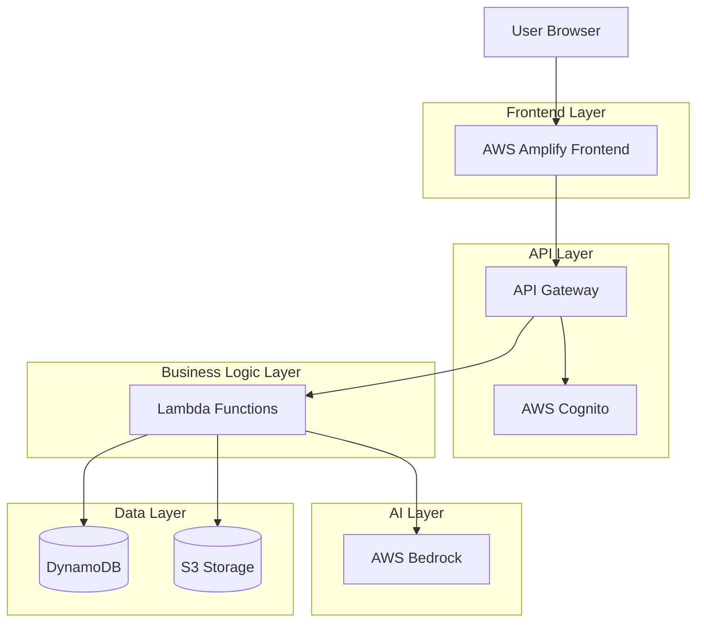

# Design Document: DevSaathi AI

## Overview

DevSaathi AI is a cloud-native, serverless AI-powered learning platform built on AWS infrastructure. The system leverages AWS Bedrock for AI capabilities, providing students and developers across Bharat with intelligent tutoring, code analysis, and documentation simplification features.

The architecture follows a serverless microservices pattern with:
- React-based frontend hosted on AWS Amplify
- AWS Lambda functions for business logic
- AWS Bedrock for AI inference
- DynamoDB for data persistence
- AWS Cognito for authentication
- AWS S3 for file storage

This design prioritizes scalability, cost-efficiency, and rapid response times while maintaining security and data privacy.

## Architecture

### High-Level Architecture



### Sequence Diagram

The sequence diagram illustrates the interaction flow between the user and system components during a learning request.

```mermaid
sequenceDiagram
    participant User
    participant Frontend
    participant APIGateway
    participant Lambda
    participant Bedrock
    participant DynamoDB
    participant S3

    User->>Frontend: Submit Topic / Code / Documentation
    Frontend->>APIGateway: Send Request
    APIGateway->>Lambda: Trigger Backend Processing
    Lambda->>Bedrock: Request AI Processing
    Bedrock-->>Lambda: Return AI Response
    Lambda->>DynamoDB: Store Learning Data
    Lambda->>S3: Store Uploaded Files
    Lambda-->>APIGateway: Send Response
    APIGateway-->>Frontend: Deliver Processed Result
   Frontend-->>User: Display Explanation / Debug Output / Summary
  ``` 


### Component Architecture

The system is organized into four primary functional domains:

1. **Learning Tutor Domain**: Handles topic explanations, quiz generation, and note creation
2. **Code Analysis Domain**: Manages code explanation, debugging, and improvement suggestions
3. **Documentation Domain**: Processes and simplifies technical documentation
4. **Dashboard Domain**: Manages user data, progress tracking, and content retrieval

Each domain is implemented as a set of Lambda functions that interact with AWS Bedrock for AI processing and DynamoDB/S3 for data persistence.

### Data Flow

**Typical Request Flow:**
1. User interacts with React frontend
2. Frontend sends authenticated request to API Gateway
3. API Gateway validates JWT token with Cognito
4. Request routes to appropriate Lambda function
5. Lambda function processes request, potentially calling Bedrock
6. Lambda stores/retrieves data from DynamoDB or S3
7. Response returns through API Gateway to frontend
8. Frontend updates UI with results

## Components and Interfaces

### Frontend Components

#### 1. Learning Tutor Interface
- **TopicInput**: Text input component for entering topics
- **ExplanationDisplay**: Renders AI-generated explanations with formatting
- **QuizComponent**: Interactive quiz interface with question display and answer submission
- **NotesViewer**: Displays and allows editing of generated notes

#### 2. Code Analysis Interface
- **CodeEditor**: Monaco-based code editor with syntax highlighting
- **LanguageSelector**: Dropdown for manual language selection (with auto-detection)
- **ExplanationPanel**: Side panel showing code explanations
- **BugList**: Displays detected bugs with severity indicators
- **ImprovementSuggestions**: Shows optimization and best practice recommendations

#### 3. Documentation Interface
- **FileUploader**: Drag-and-drop file upload component
- **DocumentViewer**: Displays original documentation
- **SummaryPanel**: Shows AI-generated summary with key points
- **ExportOptions**: Allows exporting summaries in various formats

#### 4. Dashboard Interface
- **ProgressChart**: Visual chart showing learning activity over time
- **ContentLibrary**: Organized view of notes, quizzes, and saved content
- **StatsOverview**: Displays key metrics (topics learned, average scores, etc.)
- **SearchBar**: Searches across all user content

### Backend Lambda Functions

#### Learning Tutor Functions

**explainTopic**
```typescript
Input: {
  topic: string,
  language: 'en' | 'hi',
  userId: string
}

Output: {
  explanation: string,
  examples: string[],
  relatedTopics: string[],
  timestamp: string
}
```

**generateQuiz**
```typescript
Input: {
  topic: string,
  explanation: string,
  questionCount: number,
  userId: string
}

Output: {
  quizId: string,
  questions: Array<{
    id: string,
    question: string,
    options: string[],
    correctAnswer: number
  }>,
  topic: string
}
```

**evaluateQuiz**
```typescript
Input: {
  quizId: string,
  answers: Array<{questionId: string, selectedAnswer: number}>,
  userId: string
}

Output: {
  score: number,
  totalQuestions: number,
  correctAnswers: number,
  feedback: Array<{questionId: string, correct: boolean, explanation: string}>
}
```

**generateNotes**
```typescript
Input: {
  topic: string,
  explanation: string,
  userId: string
}

Output: {
  noteId: string,
  content: string,
  keyPoints: string[],
  timestamp: string
}
```

#### Code Analysis Functions

**explainCode**
```typescript
Input: {
  code: string,
  language?: string,
  userId: string
}

Output: {
  detectedLanguage: string,
  explanation: string,
  codeBlocks: Array<{
    lines: string,
    explanation: string,
    concepts: string[]
  }>
}
```

**debugCode**
```typescript
Input: {
  code: string,
  language: string,
  userId: string
}

Output: {
  bugs: Array<{
    line: number,
    severity: 'critical' | 'moderate' | 'minor',
    description: string,
    suggestedFix: string
  }>,
  hasBugs: boolean
}
```

**suggestImprovements**
```typescript
Input: {
  code: string,
  language: string,
  userId: string
}

Output: {
  improvements: Array<{
    category: 'performance' | 'readability' | 'best-practice',
    description: string,
    originalCode: string,
    improvedCode: string,
    benefit: string
  }>
}
```

#### Documentation Functions

**processDocumentation**
```typescript
Input: {
  content: string,
  format: 'text' | 'pdf' | 'markdown',
  userId: string
}

Output: {
  summary: string,
  keyPoints: string[],
  sections: Array<{
    title: string,
    content: string
  }>,
  warnings: string[]
}
```

#### Dashboard Functions

**getUserContent**
```typescript
Input: {
  userId: string,
  contentType?: 'notes' | 'quizzes' | 'code' | 'docs',
  limit?: number,
  lastKey?: string
}

Output: {
  items: Array<ContentItem>,
  nextKey?: string,
  totalCount: number
}
```

**getProgressStats**
```typescript
Input: {
  userId: string,
  timeRange: number // days
}

Output: {
  topicsLearned: number,
  quizzesCompleted: number,
  averageScore: number,
  activityByDay: Array<{date: string, count: number}>,
  weakTopics: Array<{topic: string, score: number}>
}
```

**searchContent**
```typescript
Input: {
  userId: string,
  query: string,
  contentTypes?: string[]
}

Output: {
  results: Array<{
    id: string,
    type: string,
    title: string,
    snippet: string,
    timestamp: string
  }>
}
```

### AWS Bedrock Integration

**AI Model Selection:**
- Primary model: Claude 3 Sonnet (balanced performance and cost)
- Fallback model: Claude 3 Haiku (for simpler queries)

**Prompt Engineering Strategy:**

Each AI function uses structured prompts with:
- System context defining the role (tutor, code analyzer, etc.)
- User input with clear formatting
- Output format specifications
- Language and complexity level instructions

**Example Prompt Structure for Topic Explanation:**
```
System: You are DevSaathi, an AI tutor helping students in Bharat learn technical concepts. 
Explain topics simply with real-life examples suitable for beginners.

User: Explain [TOPIC] in simple terms with a real-life example.

Requirements:
- Use simple language
- Provide 1-2 real-life analogies
- Break down complex terms
- Keep explanation under 500 words
- Language: [LANGUAGE]
```

### Cost Optimization

DevSaathi AI is designed using a serverless and managed-services architecture to minimize operational costs while maintaining scalability and performance. The system leverages pay-per-use AWS services and incorporates multiple cost-control strategies.

**Serverless Resource Utilization**

The platform primarily uses AWS Lambda for backend processing. Lambda enables automatic scaling and eliminates the need to provision or maintain servers. Costs are incurred only when functions are executed, ensuring efficient resource utilization during peak and low usage periods.

API Gateway is used for secure API routing, which follows a request-based pricing model, ensuring the system only pays for actual API traffic.

**AI Model Cost Management**

AWS Bedrock model usage is optimized through intelligent model selection and request filtering.

**Optimization Strategies:**

- Use Claude 3 Sonnet as the default model for complex AI tasks.
- Automatically downgrade to Claude 3 Haiku for simpler queries such as   short explanations or summaries.
- Implement response caching for repeated queries to avoid redundant AI calls.
- Enforce input length limits to prevent excessive token usage.

**Database Cost Optimization**

DynamoDB uses on-demand capacity mode, allowing the database to automatically scale with traffic while preventing over-provisioning.

**Additional Strategies:**

- Use single-table design to reduce infrastructure complexity.
- Store large code files and documentation content in Amazon S3 instead of DynamoDB.
- Use indexed queries (GSI) to reduce scan operations and improve query efficiency.

**Storage Cost Optimization**

Amazon S3 is used for storing generated notes, code files, and documentation summaries. Storage costs are controlled using lifecycle policies.

**Lifecycle Strategies:**

- Move older files to S3 Infrequent Access after 30 days.
- Archive rarely accessed data using S3 Glacier storage class.
- Enable compression for stored documents and generated content.

**Monitoring and Cost Visibility**

AWS CloudWatch is used to monitor service usage and detect cost anomalies.

**Monitoring Controls:**

- Track Lambda execution duration and invocation frequency.
- Monitor Bedrock API call counts.
- Set CloudWatch alarms for unusual traffic spikes.
- Use AWS Cost Explorer to track monthly service usage trends.

**Rate Limiting and Resource Control**

API Gateway throttling limits are implemented to prevent excessive or malicious usage.

**Control Mechanisms:**

- Per-user API rate limits.
- Daily AI request quotas for free-tier users.
- Request validation to prevent unnecessary processing.
- Expected Cost Efficiency Outcomes
- The serverless design ensures:
- Minimal idle infrastructure cost.
- Automatic scaling aligned with user demand.
- Optimized AI inference cost through caching and model selection.
- Long-term storage cost reduction using lifecycle policies.

### Caching Strategy

DevSaathi AI uses a multi-layer caching strategy to improve performance, reduce AWS Bedrock costs, and support low-bandwidth users by avoiding repeated AI processing.

**Cache Objectives**

- Reduce repeated AI inference calls
- Improve response speed
- Lower infrastructure cost
- Minimize data transfer for slow networks

**AI Response Caching**

Frequently generated AI responses (topic explanations, quizzes, summaries, and code explanations) are cached.

**Implementation:**

- Store responses in Amazon DynamoDB
- Use hashed query strings as cache keys
- Store metadata like timestamp and language
- Apply TTL for automatic expiration

**Application-Level Caching**

User session data and dashboard summaries are cached to reduce database reads and improve UI performance.

**Static Content Caching**

Frontend assets are cached using AWS Amplify CDN and browser caching with compressed static files.

**Cache Invalidation**

- Expire AI responses automatically using TTL
- Refresh cache when user data or preferences change
- Performance Benefits
- Reduces AI API calls by ~30–50%
- Improves response time
- Decreases database load
- Enhances experience for low-bandwidth users

### CI/CD Pipeline

DevSaathi AI uses an automated CI/CD pipeline to ensure fast, reliable, and secure deployment of application updates. The pipeline supports continuous integration, automated testing, and scalable deployment using AWS services.

**CI/CD Objectives**

- Automate build and deployment processes
- Ensure code quality through automated testing
- Reduce manual errors during releases
- Enable faster feature delivery and bug fixes

**Continuous Integration**

- Whenever developers push code to GitHub:
- AWS CodePipeline automatically triggers the build process
- AWS CodeBuild compiles the application and runs tests
- Static code analysis and dependency checks are performed

**Continuous Deployment**

- After successful build and testing:
- Frontend is deployed using AWS Amplify
- Backend services are deployed using AWS Lambda
- API updates are managed through AWS API Gateway

**Testing Automation**

- The pipeline includes automated testing such as:
- Unit testing for backend functions
- Integration testing for API endpoints
- Basic frontend build validation

**Monitoring and Rollback**

- Deployment status is monitored using AWS CloudWatch
- Failed deployments automatically trigger rollback mechanisms
- Logs and alerts help identify deployment issues quickly

**Expected Benefits**

- Faster and safer deployments
- Improved system reliability
- Consistent release process
- Reduced development downtime

### Low Bandwidth Technical Design

DevSaathi AI is optimized to support users in rural and low-connectivity regions by minimizing data usage and improving performance on slow networks.

**Objectives**

- Ensure accessibility in low-network areas
- Reduce data consumption and server requests
- Improve response speed on slow connections
- Support low-end and affordable devices

**Lightweight Frontend Optimization**

- Use compressed and minified JS, CSS, and image assets
- Implement lazy loading for non-critical components
- Use progressive loading for essential content
- Limit heavy animations and large media

**AI Response Optimization**

- Generate concise summarized responses
- Cache frequently requested AI outputs
- Prefer structured text responses over multimedia

**Offline and Session Support**

- Cache recently accessed content in browser storage
- Store learning progress locally during connection loss
- Automatically sync data when connectivity is restored

**Adaptive Network Handling**

- Detect slow network conditions on client side
- Reduce API calls during poor connectivity
- Serve cached or simplified content versions

**Backend Optimization**

- Use serverless architecture for fast processing
- Optimize API payload size
- Use caching and database indexing for quick retrieval

**Expected Benefits**

- Better accessibility for rural users
- Lower data consumption
- Faster performance on slow networks
- Improved learning continuity during unstable connectivity

### Data Models

#### User Model
```typescript
interface User {
  userId: string;          // Primary key (Cognito sub)
  email: string;
  createdAt: string;
  lastLoginAt: string;
  preferences: {
    language: 'en' | 'hi';
    theme: 'light' | 'dark';
  };
}
```

#### Note Model
```typescript
interface Note {
  noteId: string;          // Primary key
  userId: string;          // GSI partition key
  topic: string;
  content: string;
  keyPoints: string[];
  createdAt: string;       // GSI sort key
  updatedAt: string;
  tags: string[];
}
```

#### Quiz Model
```typescript
interface Quiz {
  quizId: string;          // Primary key
  userId: string;          // GSI partition key
  topic: string;
  questions: Question[];
  createdAt: string;       // GSI sort key
}

interface Question {
  id: string;
  question: string;
  options: string[];
  correctAnswer: number;
}
```

#### Quiz Result Model
```typescript
interface QuizResult {
  resultId: string;        // Primary key
  userId: string;          // GSI partition key
  quizId: string;
  topic: string;
  score: number;
  totalQuestions: number;
  correctAnswers: number;
  completedAt: string;     // GSI sort key
  answers: Array<{
    questionId: string;
    selectedAnswer: number;
    correct: boolean;
  }>;
}
```

#### Code Analysis Model
```typescript
interface CodeAnalysis {
  analysisId: string;      // Primary key
  userId: string;          // GSI partition key
  code: string;            // Stored in S3, reference here
  language: string;
  explanation: string;
  bugs: Bug[];
  improvements: Improvement[];
  createdAt: string;       // GSI sort key
}

interface Bug {
  line: number;
  severity: 'critical' | 'moderate' | 'minor';
  description: string;
  suggestedFix: string;
}

interface Improvement {
  category: 'performance' | 'readability' | 'best-practice';
  description: string;
  originalCode: string;
  improvedCode: string;
  benefit: string;
}
```

#### Documentation Summary Model
```typescript
interface DocumentationSummary {
  summaryId: string;       // Primary key
  userId: string;          // GSI partition key
  originalFile: string;    // S3 reference
  summary: string;
  keyPoints: string[];
  sections: Section[];
  createdAt: string;       // GSI sort key
}

interface Section {
  title: string;
  content: string;
}
```

### DynamoDB Table Design

**Single Table Design:**

Table: `DevSaathiData`
- Partition Key: `PK` (string)
- Sort Key: `SK` (string)
- GSI1: `GSI1PK` (string), `GSI1SK` (string)

**Access Patterns:**

1. Get user by ID: `PK=USER#<userId>`, `SK=PROFILE`
2. Get user notes: `GSI1PK=USER#<userId>`, `GSI1SK` begins_with `NOTE#`
3. Get user quizzes: `GSI1PK=USER#<userId>`, `GSI1SK` begins_with `QUIZ#`
4. Get quiz results: `GSI1PK=USER#<userId>`, `GSI1SK` begins_with `RESULT#`
5. Get code analyses: `GSI1PK=USER#<userId>`, `GSI1SK` begins_with `CODE#`
6. Get doc summaries: `GSI1PK=USER#<userId>`, `GSI1SK` begins_with `DOC#`

**Example Items:**

```typescript
// User Profile
{
  PK: "USER#123",
  SK: "PROFILE",
  email: "user@example.com",
  createdAt: "2024-01-15T10:00:00Z",
  preferences: {...}
}

// Note
{
  PK: "NOTE#456",
  SK: "METADATA",
  GSI1PK: "USER#123",
  GSI1SK: "NOTE#2024-01-15T10:30:00Z",
  topic: "React Hooks",
  content: "...",
  keyPoints: [...]
}

// Quiz Result
{
  PK: "RESULT#789",
  SK: "METADATA",
  GSI1PK: "USER#123",
  GSI1SK: "RESULT#2024-01-15T11:00:00Z",
  quizId: "QUIZ#456",
  topic: "JavaScript Promises",
  score: 80,
  completedAt: "2024-01-15T11:00:00Z"
}
```


## Correctness Properties

*A property is a characteristic or behavior that should hold true across all valid executions of a system—essentially, a formal statement about what the system should do. Properties serve as the bridge between human-readable specifications and machine-verifiable correctness guarantees.*

### Learning Tutor Properties

**Property 1: Explanation contains examples**
*For any* topic explanation generated by the Learning Tutor, the response should contain at least one real-life example or analogy section.
**Validates: Requirements 1.2**

**Property 2: Broad topics are decomposed**
*For any* broad topic (topics with multiple subtopics like "programming", "databases", "web development"), the explanation should contain multiple distinct subtopic sections.
**Validates: Requirements 1.3**

**Property 3: Follow-up questions maintain context**
*For any* follow-up question in a session, the response should reference or build upon the previous explanation context.
**Validates: Requirements 1.4**

**Property 4: Language support consistency**
*For any* topic, when the language parameter is set to Hindi, the response should be in Hindi, and when set to English, the response should be in English.
**Validates: Requirements 1.5**

**Property 5: Quiz question count bounds**
*For any* generated quiz, the number of questions should be between 5 and 10 inclusive.
**Validates: Requirements 2.2**

**Property 6: Quiz evaluation completeness**
*For any* quiz and any set of user answers, the evaluation should return feedback for every question in the quiz.
**Validates: Requirements 2.3**

**Property 7: Score calculation accuracy**
*For any* quiz result, the score percentage should equal (number of correct answers / total questions) × 100, and the average score across multiple quizzes should equal the sum of all scores divided by the number of quizzes.
**Validates: Requirements 2.4, 9.1**

**Property 8: Generated content structure**
*For any* generated notes or documentation summary, the content should contain structural elements including headings, bullet points, and key points sections.
**Validates: Requirements 3.1, 3.2, 7.3, 7.4**

**Property 9: Content persistence and retrieval**
*For any* created note, quiz result, code analysis, or documentation summary, querying the user's dashboard should return that content with a timestamp.
**Validates: Requirements 2.5, 3.3, 8.1, 8.2**

**Property 10: CRUD operations consistency**
*For any* stored content item, updating it should result in the stored version reflecting the changes, and deleting it should remove it from subsequent queries.
**Validates: Requirements 3.4, 8.5**

**Property 11: Search result relevance**
*For any* search query on user notes, all returned results should contain the search keywords in either the topic or content fields.
**Validates: Requirements 3.5**

### Code Analysis Properties

**Property 12: Language detection accuracy**
*For any* valid code snippet in a supported language (Python, JavaScript, TypeScript, Java, C++, Go), the language detector should correctly identify the programming language.
**Validates: Requirements 4.1**

**Property 13: Code explanation structure**
*For any* code submitted for explanation, the response should contain references to specific lines or code blocks with corresponding explanations.
**Validates: Requirements 4.2**

**Property 14: Function identification in explanations**
*For any* code containing function definitions, the explanation should identify and explain those functions.
**Validates: Requirements 4.3**

**Property 15: Language support coverage**
*For any* code in Python, JavaScript, TypeScript, Java, C++, or Go, the system should successfully process and analyze it without errors.
**Validates: Requirements 4.4**

**Property 16: Bug detection for known issues**
*For any* code containing known syntax errors or common logical errors, the bug detection should identify at least one issue.
**Validates: Requirements 5.1**

**Property 17: Bug and improvement suggestion structure**
*For any* detected bug or improvement suggestion, the response should contain a description field, an explanation of impact or benefit, and suggested code changes.
**Validates: Requirements 5.2, 5.3, 6.3**

**Property 18: Bug severity classification**
*For any* detected bugs, each bug should have a severity level that is one of: 'critical', 'moderate', or 'minor'.
**Validates: Requirements 5.4**

**Property 19: Performance optimization detection**
*For any* code with known performance issues (nested loops, inefficient algorithms), the improvement suggestions should include at least one performance-related suggestion.
**Validates: Requirements 6.1**

**Property 20: Best practice suggestions**
*For any* code that violates common best practices (magic numbers, long functions, unclear naming), the improvement suggestions should identify these issues.
**Validates: Requirements 6.2**

**Property 21: Readability improvement suggestions**
*For any* code with readability issues (functions over 50 lines, deeply nested conditionals), the suggestions should include readability improvements.
**Validates: Requirements 6.4**

### Documentation Processing Properties

**Property 22: Documentation format support**
*For any* valid file in plain text, PDF, or Markdown format, the documentation processor should successfully parse and process it.
**Validates: Requirements 7.1**

**Property 23: Large document multi-section summaries**
*For any* documentation exceeding 10,000 words, the generated summary should contain multiple distinct sections with navigation elements.
**Validates: Requirements 7.5**

### Dashboard and Data Management Properties

**Property 24: Content categorization**
*For any* user's stored content, querying by a specific category (notes, quizzes, code, docs) should return only items of that category type.
**Validates: Requirements 8.3**

**Property 25: Chronological ordering**
*For any* user's content list, items should be ordered such that each item's timestamp is greater than or equal to the next item's timestamp (reverse chronological order).
**Validates: Requirements 8.4**

**Property 26: Activity data time range**
*For any* user's progress chart data, the activity data should cover exactly the specified time range (e.g., 30 days) with no gaps.
**Validates: Requirements 9.2**

**Property 27: Improvement trend calculation**
*For any* topic with multiple quiz attempts, the system should calculate whether scores are improving (later scores > earlier scores), declining (later scores < earlier scores), or stable.
**Validates: Requirements 9.3**

**Property 28: Weak topic identification**
*For any* user's weak topics list, all included topics should have an average quiz score below 60%.
**Validates: Requirements 9.4**

### Authentication and Security Properties

**Property 29: JWT token validation**
*For any* valid user credentials authenticated through Cognito, the system should return a valid JWT token that can be verified.
**Validates: Requirements 10.2**

**Property 30: Password requirement enforcement**
*For any* password that does not meet requirements (less than 8 characters, missing uppercase, lowercase, or numbers), the registration should fail with a validation error.
**Validates: Requirements 10.3**

**Property 31: Session expiration**
*For any* user session, if the token is older than 24 hours, authentication attempts should fail with an expired token error.
**Validates: Requirements 10.5**

**Property 32: AI uncertainty acknowledgment**
*For any* AI query that returns low confidence (confidence score below threshold), the response should contain an uncertainty acknowledgment and alternative resource suggestions.
**Validates: Requirements 11.2**

**Property 33: Conversation context maintenance**
*For any* follow-up question within a session, the AI response should reference or utilize information from previous messages in that session.
**Validates: Requirements 11.3**

### Data Persistence Properties

**Property 34: Data retention until deletion**
*For any* user data stored in the system, it should remain accessible through queries until the user explicitly deletes it.
**Validates: Requirements 13.5**

### Error Handling Properties

**Property 35: User-friendly error messages**
*For any* system error, the error response should contain a user-friendly message (avoiding technical jargon) and suggested actions for resolution.
**Validates: Requirements 14.4**

### Input Validation Properties

**Property 36: Input limit enforcement**
*For any* user input, if it exceeds defined limits (code > 5,000 lines, files > 10 MB, queries > 500 characters), the system should reject it with a clear error message specifying which limit was exceeded.
**Validates: Requirements 15.1, 15.2, 15.3, 15.4**

**Property 37: Input sanitization**
*For any* user input containing malicious patterns (SQL injection attempts, XSS scripts, command injection), the system should either reject the input or sanitize it before processing.
**Validates: Requirements 15.5**

## Error Handling

### Error Categories

**1. User Input Errors**
- Invalid format (unsupported file types, malformed code)
- Exceeded limits (file size, code length, query length)
- Missing required fields

**Response Strategy:**
- Return 400 Bad Request
- Provide specific error message indicating what was invalid
- Suggest corrective action

**2. Authentication Errors**
- Invalid credentials
- Expired tokens
- Insufficient permissions

**Response Strategy:**
- Return 401 Unauthorized or 403 Forbidden
- Clear error message without exposing security details
- Redirect to login if token expired

**3. AI Processing Errors**
- Bedrock API failures
- Timeout errors
- Low confidence responses

**Response Strategy:**
- Return 503 Service Unavailable for API failures
- Implement retry logic with exponential backoff (3 attempts)
- For low confidence, return 200 with uncertainty acknowledgment
- Log errors for monitoring

**4. Data Persistence Errors**
- DynamoDB write failures
- S3 upload failures
- Data retrieval errors

**Response Strategy:**
- Return 500 Internal Server Error
- Implement retry logic for transient failures
- Log errors with context for debugging
- Return generic error message to user (don't expose internal details)

**5. Rate Limiting Errors**
- Too many requests from single user
- System overload

**Response Strategy:**
- Return 429 Too Many Requests
- Include Retry-After header
- Queue requests if possible
- Provide estimated wait time

### Error Response Format

All errors follow a consistent JSON structure:

```typescript
interface ErrorResponse {
  error: {
    code: string;           // Machine-readable error code
    message: string;        // User-friendly error message
    details?: string;       // Additional context (optional)
    suggestedAction?: string; // What user should do next
    timestamp: string;      // ISO 8601 timestamp
    requestId: string;      // For support/debugging
  }
}
```

### Logging and Monitoring

**CloudWatch Logs:**
- All Lambda functions log to CloudWatch
- Structured logging with JSON format
- Include requestId, userId, function name, error details

**CloudWatch Alarms:**
- Lambda error rate > 5%
- Lambda duration > 8 seconds (80% of timeout)
- DynamoDB throttling events
- Bedrock API error rate > 2%

**X-Ray Tracing:**
- Enable X-Ray for all Lambda functions
- Trace end-to-end request flow
- Identify bottlenecks and failures

## Testing Strategy

### Dual Testing Approach

DevSaathi AI requires both unit testing and property-based testing for comprehensive coverage:

**Unit Tests** focus on:
- Specific examples demonstrating correct behavior
- Edge cases (empty inputs, boundary values, special characters)
- Error conditions and error handling paths
- Integration points between components
- Mock responses from AWS services

**Property-Based Tests** focus on:
- Universal properties that hold for all inputs
- Comprehensive input coverage through randomization
- Validating correctness properties defined in this document
- Testing with generated data across wide input ranges

Both approaches are complementary and necessary. Unit tests catch concrete bugs and verify specific scenarios, while property tests verify general correctness across all possible inputs.

### Property-Based Testing Configuration

**Library Selection:**
- **JavaScript/TypeScript**: fast-check
- **Python**: Hypothesis

**Test Configuration:**
- Minimum 100 iterations per property test (due to randomization)
- Each property test must reference its design document property
- Tag format: `Feature: devsaathi-ai, Property {number}: {property_text}`

**Example Property Test Structure:**

```typescript
// Feature: devsaathi-ai, Property 5: Quiz question count bounds
describe('Quiz Generation Properties', () => {
  it('should generate between 5 and 10 questions for any topic', () => {
    fc.assert(
      fc.asyncProperty(
        fc.string({ minLength: 3, maxLength: 100 }), // topic
        fc.string({ minLength: 50, maxLength: 1000 }), // explanation
        async (topic, explanation) => {
          const quiz = await generateQuiz({ topic, explanation, userId: 'test' });
          expect(quiz.questions.length).toBeGreaterThanOrEqual(5);
          expect(quiz.questions.length).toBeLessThanOrEqual(10);
        }
      ),
      { numRuns: 100 }
    );
  });
});
```

### Unit Testing Strategy

**Frontend Testing:**
- React Testing Library for component tests
- Jest for unit tests
- Mock API responses
- Test user interactions and UI state changes

**Backend Testing:**
- Jest for Lambda function tests
- Mock AWS SDK calls (Bedrock, DynamoDB, S3, Cognito)
- Test business logic in isolation
- Integration tests with LocalStack for AWS services

**Test Coverage Goals:**
- Minimum 80% code coverage
- 100% coverage for critical paths (authentication, data persistence)
- All error handling paths tested

### Integration Testing

**API Integration Tests:**
- Test complete request/response cycles
- Use test DynamoDB tables and S3 buckets
- Mock Bedrock responses (to avoid costs)
- Verify data persistence and retrieval

**End-to-End Testing:**
- Cypress for critical user flows
- Test complete features (topic explanation → quiz → results)
- Run against staging environment
- Automated in CI/CD pipeline

### Testing Each Correctness Property

Each of the 37 correctness properties defined in this document must be implemented as a property-based test. The test should:

1. Generate random valid inputs using the property testing library
2. Execute the system function with those inputs
3. Assert that the property holds true
4. Run for minimum 100 iterations
5. Include a comment tag referencing the property number and text

**Example mapping:**

- Property 1 → Test that all explanations contain example markers
- Property 5 → Test that all quizzes have 5-10 questions
- Property 7 → Test that score calculations are mathematically correct
- Property 12 → Test language detection with code samples in all supported languages
- Property 36 → Test input validation with inputs at and beyond limits

### Performance Testing

**Load Testing:**
- Simulate 100+ concurrent users
- Test response times under load
- Identify bottlenecks
- Use Artillery or k6 for load generation

**Stress Testing:**
- Test system behavior at capacity limits
- Verify graceful degradation
- Test queue mechanisms
- Monitor AWS service limits

### Security Testing

**Input Validation Testing:**
- Test with malicious inputs (SQL injection, XSS, command injection)
- Verify sanitization and rejection
- Test file upload security

**Authentication Testing:**
- Test token expiration
- Test invalid credentials
- Test authorization boundaries

**Penetration Testing:**
- Conduct periodic security audits
- Test for OWASP Top 10 vulnerabilities
- Verify encryption at rest and in transit
